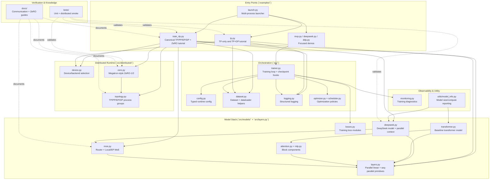

# Nano-Train

Learning-first distributed training repo focused on Megatron-style parallelism:
Tensor (TP), Pipeline (PP), Expert (EP), Data (DP), and ZeRO-1/2.

## Current Status

- Main tutorial entrypoint: `examples/train_4p.py` (TP/PP/EP/DP + ZeRO-1/2).
- Focused TP/DP learning path: `examples/tp.py`.
- ZeRO implementation: `src/distributed/zero.py` (`optim`, `optim_grads`).
- DeepSeek-style model stack:
  - `src/models/deepseek.py`
  - `src/models/moe.py`
- Current tutorial constraints in `examples/train_4p.py`:
  - `tensor-model-parallel-size > 1` with `expert-model-parallel-size > 1` is disallowed.
  - `expert-tensor-parallel-size == 1`.
  - `context-parallel-size == 1`.
  - ZeRO-3 (`optim_grads_params`) is out of scope.

## Quick Start

### Install

```bash
git clone https://github.com/lastweek/nano-train.git
cd nano-train
pip install -r requirements.txt
```

### Single-Rank Smoke

```bash
python3 examples/train_4p.py \
  --tensor-model-parallel-size 1 \
  --pipeline-model-parallel-size 1 \
  --expert-model-parallel-size 1 \
  --max_steps 2
```

### 4P + ZeRO-2 Smoke

```bash
python3 examples/launch.py --world-size 4 --backend gloo \
  --script examples/train_4p.py --script-args \
  --tensor-model-parallel-size 1 \
  --pipeline-model-parallel-size 2 \
  --expert-model-parallel-size 2 \
  --num_microbatches 2 \
  --use-distributed-optimizer \
  --data-parallel-sharding-strategy optim_grads \
  --max_steps 1
```

## Key Entrypoints

| Path | Purpose |
|---|---|
| `examples/train_4p.py` | Canonical TP/PP/EP/DP tutorial script with optional ZeRO-1/2 |
| `examples/tp.py` | TP-only and TP+DP tutorial path |
| `examples/launch.py` | Multi-process launcher for local distributed runs |
| `src/distributed/topology.py` | Parallel group/rank topology setup |
| `src/distributed/zero.py` | Megatron-style ZeRO-1/2 optimizer implementation |
| `src/trainer.py` | Shared trainer loop and checkpoint integration hooks |

## Architecture Diagram



## Learning Guides

- [Docs Index](docs/README.md)
- [TP + DP Communication](docs/tp_dp_communication.md)
- [TP + EP + DP Communication](docs/ep_tp_dp_communication.md)
- [TP + PP + EP + DP Communication](docs/pp_tp_ep_dp_communication.md)
- [DeepSeekMoE Auxiliary Losses](docs/deepseek_moe_aux_losses.md)
- [Megatron ZeRO-1/2 Design](docs/megatron_zero1_zero2_design.md)
- [ZeRO-1/2 Intuitive Summary](docs/zero1_zero2_intuitive_summary.md)
- [ZeRO-1/2 Quickstart](docs/zero1_zero2_quickstart.md)

## Progress Tracker

### Completed Milestones

| Date | Commit | Milestone | Major Files Changed |
|---|---|---|---|
| 2026-02-09 | `5cfeb63` | Initial repo bootstrap | `README.md`, `src/*`, `examples/*`, `tests/*` |
| 2026-02-13 | `8044208` | MVP stack refactor + model efficiency reporting | `src/trainer.py`, `src/utils/model_info.py`, `docs/model_info.md` |
| 2026-02-19 | `9c12e7e` | Monitoring v2 stability/perf metrics | `src/trainer.py`, `src/config.py`, `src/monitoring.py`, `docs/training_monitoring_metrics_reference.md` |
| 2026-02-24 | `5206984` | Canonical TP + DP tutorial pipeline | `examples/tp.py`, `src/layers.py`, `docs/tp_dp_communication.md` |
| 2026-02-25 | `64b9df3` | EP tutorial path (TP + EP + DP) | `examples/train_4p.py`, `src/models/moe.py`, `src/models/deepseek.py`, `docs/ep_tp_dp_communication.md` |
| 2026-02-25 | `5855268` | Docs IA/readability overhaul | `docs/README.md`, `docs/*.md`, `README.md`, `src/utils/model_info.py` |
| 2026-02-26 | `69188d8` | 4P entrypoint rename + ZeRO-1/2 integration and debug visibility | `examples/train_4p.py`, `src/distributed/zero.py`, `src/trainer.py`, `docs/zero1_zero2_*.md`, `tests/test_zero_*.py` |

### Planned Next Milestones

| Status | Milestone | Expected Focus Files |
|---|---|---|
| In Progress | Canonical TP+EP mapping (remove TP+EP guard, avoid expert replication) | `examples/train_4p.py`, `src/distributed/topology.py`, `src/models/deepseek.py`, `docs/ep_tp_dp_communication.md`, `docs/pp_tp_ep_dp_communication.md` |
| Planned | EP robustness hardening (EDP sync/diagnostics + checks) | `examples/train_4p.py`, `src/models/moe.py`, `tests/test_train_4p_script_logic.py` |
| Planned | DeepSeek parallel context cleanup and simplification | `src/models/deepseek.py`, `tests/test_deepseek_model.py` |
| Planned | Device-level MoE aux loss (`L_devbal`) support | `src/models/moe.py`, `examples/train_4p.py`, `docs/deepseek_moe_aux_losses.md` |
| Planned | Checkpoint resume path for ZeRO sharded optimizer in trainer | `src/trainer.py`, `src/distributed/zero.py`, `docs/zero1_zero2_quickstart.md` |

## Repository Layout

```text
docs/         learning and implementation guides
examples/     runnable training/tutorial scripts
src/          core training/model/distributed modules
tests/        unit and distributed smoke tests
scripts/      local helper scripts
```

## Development Checks

```bash
pytest -q
ruff check .
ruff format --check .
mypy src/
```

## License

MIT License.
