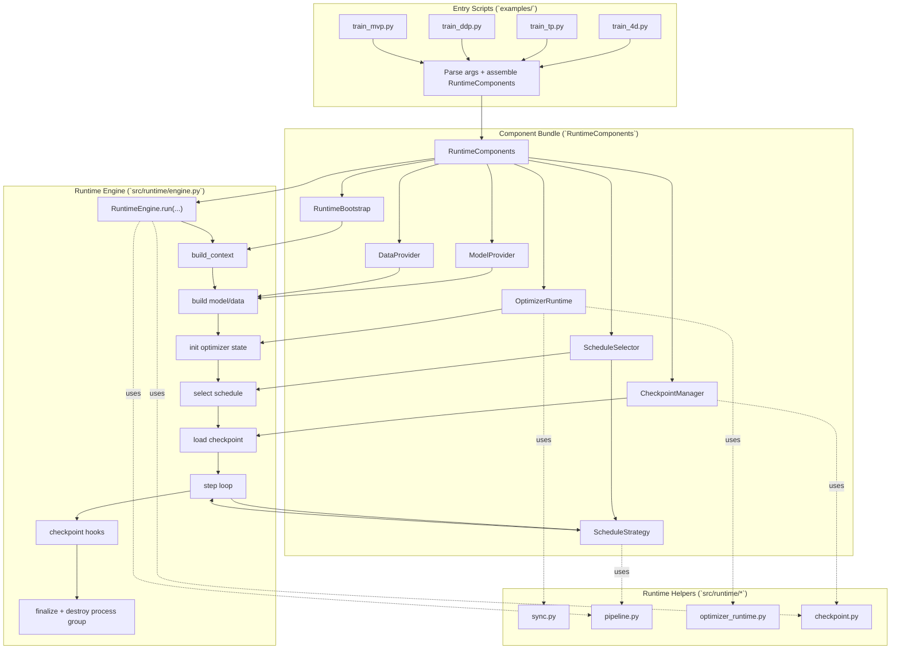
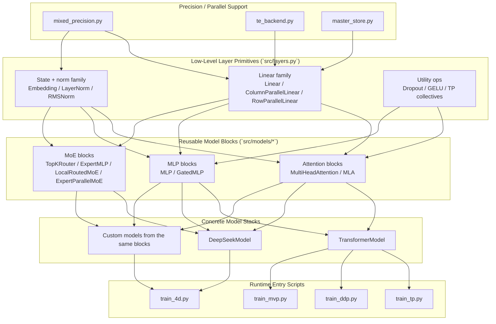

# Nano-Train

`nano-train` is a learning-first distributed LLM training repo built around Megatron-style
parallelism. It started as a compact training sandbox and has gradually grown into a reusable
runtime-backed system that now covers TP, PP, EP, DP, ZeRO-1/2, and mixed precision on a
DeepSeek-style model stack.

## What Nano-Train Is

- A practical repo for understanding how modern distributed training systems are assembled,
  not just how a single training loop runs.
- A runtime-backed training system where orchestration lives in `src/runtime/*` and scenario
  wiring lives in thin entry scripts under `examples/`.
- A reusable model-building stack where parallelism-aware and precision-aware primitives in
  `src/layers.py` are composed into reusable blocks and full model stacks.
- A place to study Megatron-style concepts concretely: tensor parallelism, pipeline
  parallelism, expert parallelism, data parallelism, optimizer sharding, and low-bit training.

## What It Can Do Today

- **Parallel training**: TP, PP, EP, DP, and their combined 4D tutorial path are built and
  runnable through `examples/train_4d.py`.
- **Training runtime**: a reusable `RuntimeEngine` and `RuntimeComponents` model now powers
  `train_4d`, `train_tp`, `train_ddp`, and `train_mvp`.
- **Optimization/runtime systems**: ZeRO-1/2, mixed precision (`bf16`, `fp16`, `fp8`, `fp4`),
  DeepSeek-V3-style FP8 recipe support, and optimizer-owned low-bit master weight paths are
  implemented in the current runtime/tutorial path.
- **Checkpoint/runtime interface**: the current ZeRO checkpoint path uses format v2 in the
  current implementation.
- **Model/tutorial stack**: low-level precision-aware and parallelism-aware layer primitives,
  reusable attention/MLP/MoE blocks, `TransformerModel`, `DeepSeekModel`, TP/DDP/MVP examples,
  monitoring utilities, and model inspection tooling are included.

## Start Here

1. Start with `examples/train_4d.py` for the canonical TP/PP/EP/DP + ZeRO tutorial path.
2. Use `examples/train_tp.py` for a smaller TP/DP-focused learning path.
3. Use `examples/train_ddp.py` and `examples/train_mvp.py` for narrower runtime-backed
   examples.

## Quick Start

### Install

```bash
git clone https://github.com/lastweek/nano-train.git
cd nano-train
pip install -r requirements.txt
```

Run this first to confirm the canonical entrypoint works on one process:

```bash
python3 examples/train_4d.py \
  --tensor-model-parallel-size 1 \
  --pipeline-model-parallel-size 1 \
  --expert-model-parallel-size 1 \
  --max_steps 2
```

Run this next to exercise the full 4D runtime path with ZeRO-2 style optimizer sharding:

```bash
python3 examples/launch.py --world-size 4 --backend gloo \
  --script examples/train_4d.py --script-args \
  --tensor-model-parallel-size 1 \
  --pipeline-model-parallel-size 2 \
  --expert-model-parallel-size 2 \
  --num_microbatches 2 \
  --use-distributed-optimizer \
  --data-parallel-sharding-strategy optim_grads \
  --max_steps 1
```

Use this to validate the low-bit mixed-precision path without depending on Transformer Engine:

```bash
python3 examples/train_4d.py \
  --tensor-model-parallel-size 1 \
  --pipeline-model-parallel-size 1 \
  --expert-model-parallel-size 1 \
  --fp8 \
  --fp8-backend emulated \
  --lowbit-master-ownership optimizer \
  --params-dtype bf16 \
  --main-params-dtype fp32 \
  --main-grads-dtype fp32 \
  --exp-avg-dtype fp32 \
  --exp-avg-sq-dtype fp32 \
  --max_steps 1
```

Use this to validate the DeepSeek-V3 recipe defaults:

```bash
python3 examples/train_4d.py \
  --tensor-model-parallel-size 1 \
  --pipeline-model-parallel-size 1 \
  --expert-model-parallel-size 1 \
  --precision-recipe deepseek_v3 \
  --fp8 \
  --fp8-backend emulated \
  --max_steps 1
```

DeepSeek precision notes:

- `--precision-recipe deepseek_v3` defaults to FP8 with `tile_1x128` activation granularity,
  `block_128x128` weight granularity, stochastic rounding, and MoE payload comm-quant enabled.
- For `DeepSeekModel`, prefer exact-path config overrides through
  `DeepSeekModelConfig.module_compute_dtype_overrides`.
- `--module-compute-dtype-rule '<module_pattern>=<fp32|bf16|fp16>'` remains available as a
  generic fallback for fast experiments or non-DeepSeek scripts.
- DeepSeek precision details and precedence rules live in
  [docs/deepseek_precision_configuration.md](docs/deepseek_precision_configuration.md).

## Architecture Today

`nano-train` now has two important architectural layers. The runtime layer explains how
training is orchestrated across scripts, schedules, and checkpoint hooks. The model-building
layer explains how reusable low-level layer primitives are composed into blocks and then into
concrete model stacks such as `TransformerModel` and `DeepSeekModel`.

### Training Orchestration View

This view shows how training runs. Entry scripts stay thin, assemble `RuntimeComponents`, and
delegate orchestration to `RuntimeEngine`.



### Model Construction View

This view shows the reusable internal architecture that sits below the runtime shell. Precision
policy and parallel-aware execution feed into low-level layer primitives, which are composed
into model blocks and then concrete model stacks.



`src/layers.py` is the reusable foundation for both precision-aware and parallelism-aware
execution. `src/models/*` builds higher-level attention, MLP, and MoE blocks on top of those
primitives. `TransformerModel` and `DeepSeekModel` are concrete examples, not special cases,
and additional models can be built from the same internal layer stack.

If you want the architecture and API details, read
[docs/runtime_core_design.md](docs/runtime_core_design.md). For DeepSeek-specific precision
overrides and precedence rules, see
[docs/deepseek_precision_configuration.md](docs/deepseek_precision_configuration.md).

## Key Entrypoints

| Path | Purpose |
|---|---|
| `examples/train_4d.py` | Canonical 4D tutorial path: TP/PP/EP/DP + ZeRO-1/2 |
| `examples/train_tp.py` | Smaller TP + DP runtime-backed tutorial |
| `examples/train_ddp.py` | DDP-focused runtime-backed example |
| `examples/train_mvp.py` | MVP training path wired through the runtime |
| `src/runtime/engine.py` | Orchestration engine for runtime-backed scripts |
| `src/runtime/contracts.py` | Component interfaces and runtime dataclasses |
| `src/runtime/mixed_precision.py` | Precision policy, autocast, scaling, and low-bit wiring |
| `src/distributed/zero.py` | Megatron-style ZeRO-1/2 optimizer implementation |
| `src/layers.py` | Low-level parallelism-aware and precision-aware layer primitives |
| `src/models/attention.py` | Reusable attention blocks used by transformer-style models |
| `src/models/mlp.py` | Reusable feed-forward blocks used across model stacks |
| `src/models/deepseek.py` | DeepSeek-style decoder and parallel-context model path |
| `src/models/moe.py` | Routed MoE layers and expert-parallel communication |

## How We Got Here

1. **Bootstrap**: the repo started as a compact training playground with native layers,
   basic model pieces, and runnable examples so the core mechanics were easy to inspect.
2. **MVP trainer/model stack**: the training loop and model/config stack became structured
   enough to support more than one toy path, which created a base for later refactors.
3. **Monitoring and observability**: stability and performance metrics were added so training
   behavior could be diagnosed instead of guessed.
4. **TP + DP tutorial path**: tensor/data parallelism moved the repo from single-process
   demos into real distributed tutorial territory.
5. **EP + DeepSeek-style MoE**: routed experts, expert parallelism, and a DeepSeek-style
   model stack made the repo reflect more modern large-model training patterns.
6. **PP + 4D entrypoint**: pipeline support and `train_4d.py` made the project a true
   TP/PP/EP/DP tutorial system instead of separate isolated modes.
7. **ZeRO-1/2 integration**: optimizer sharding added a memory/system dimension that matters
   for serious large-scale training.
8. **Runtime core refactor**: orchestration was moved into `src/runtime/*`, leaving thin
   scripts and reusable engine/components rather than one-off training entrypoints.
9. **Mixed precision expansion**: Megatron-style precision flags, DeepSeek-V3 recipe support,
   per-module low-bit policy, and config-first DeepSeek precision overrides completed the
   current runtime stack.

## Current Guardrails

- `examples/train_4d.py` currently disallows `tensor-model-parallel-size > 1` together with
  `expert-model-parallel-size > 1`.
- `expert_tensor_parallel_size == 1` is currently required.
- `context_parallel_size == 1` is currently required.
- ZeRO-3 (`optim_grads_params`) is out of scope in the current tutorial/runtime path.
- Low-bit kernel coverage today is primarily the linear family; other modules can still carry
  per-module precision state, but they do not all have dedicated low-bit kernels.

## Validation Status

At the time of this README refresh, the local full test suite passed with:

```bash
pytest -q
# 220 passed
```

This is a point-in-time local validation result, not a blanket guarantee for every machine,
backend, or optional dependency combination.

## Learning Guides

- [Docs Index](docs/README.md)
- [Runtime Core Design](docs/runtime_core_design.md)
- [DeepSeek Precision Configuration](docs/deepseek_precision_configuration.md)
- [TP + DP Communication](docs/tp_dp_communication.md)
- [TP + EP + DP Communication](docs/ep_tp_dp_communication.md)
- [TP + PP + EP + DP Communication](docs/pp_tp_ep_dp_communication.md)
- [DeepSeekMoE Auxiliary Losses](docs/deepseek_moe_aux_losses.md)
- [Megatron ZeRO-1/2 Design](docs/megatron_zero1_zero2_design.md)
- [ZeRO-1/2 Intuitive Summary](docs/zero1_zero2_intuitive_summary.md)
- [ZeRO-1/2 Quickstart](docs/zero1_zero2_quickstart.md)

## Development Checks

```bash
pytest -q
ruff check .
ruff format --check .
mypy src/
```

## License

MIT License.
