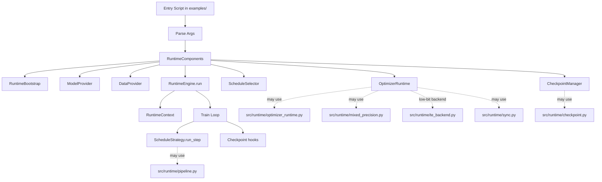

# Runtime Core Design

**Purpose**: Explain the runtime system architecture, abstractions, APIs, and usage pattern for
runtime-backed scripts.

**Audience**: Contributors building or extending training entrypoints under `examples/`.

**Prerequisites**:
- Basic PyTorch training loop familiarity
- Basic distributed training terms (DP/TP/PP/EP)

**Related Docs**:
- [Project README](../README.md)
- [Documentation Index](README.md)
- [TP + PP + EP + DP Communication Guide](pp_tp_ep_dp_communication.md)

## Table of Contents

- [1) Runtime Mental Model](#1-runtime-mental-model)
- [2) Architecture at a Glance](#2-architecture-at-a-glance)
- [3) Abstraction Design and Boundaries](#3-abstraction-design-and-boundaries)
- [4) Engine Lifecycle](#4-engine-lifecycle)
- [5) API Quick Reference](#5-api-quick-reference)
- [6) How to Use the Runtime Pattern](#6-how-to-use-the-runtime-pattern)
- [7) Current Script Mapping](#7-current-script-mapping)
- [8) Known Guardrails](#8-known-guardrails)
- [9) Troubleshooting](#9-troubleshooting)
- [10) Mixed Precision Integration](#10-mixed-precision-integration)

## 1) Runtime Mental Model

The runtime system follows one core pattern:

`thin script + RuntimeEngine + RuntimeComponents`

- Thin script:
  - owns CLI args and script-specific startup
  - defines script-local runtime components
  - calls `RuntimeEngine().run(...)`
- `RuntimeEngine`:
  - owns orchestration flow and loop lifecycle
  - does not own model/domain-specific math
- `RuntimeComponents`:
  - inject script-specific behavior (bootstrap/model/data/optimizer/schedule/checkpoint)

Why this exists:
- Keep orchestration logic reusable.
- Keep domain-specific logic near each entry script.
- Allow different scripts (`train_4d`, `train_tp`, `train_ddp`, `train_mvp`) to share one loop
  skeleton.

What it does not try to solve:
- It is not a model framework.
- It is not a universal distributed topology API.
- It does not hide all script differences; it standardizes orchestration boundaries.

## 2) Architecture at a Glance



## 3) Abstraction Design and Boundaries

| Abstraction | Owns | Do | Do Not |
|---|---|---|---|
| `RuntimeBootstrap` | Startup context construction | Validate args, init process groups/topology, construct `RuntimeContext` | Run train loop |
| `ModelProvider` | Model construction | Build model for current rank/context | Parse CLI or init topology |
| `DataProvider` | Train data construction | Build loader/sampler bundle | Perform optimizer logic |
| `OptimizerRuntime` | Step policy | Init optimizer state, zero grads, apply step policy and sync policy | Own epoch/step loop |
| `ScheduleSelector` | Mode dispatch | Choose schedule strategy from context | Perform all training orchestration |
| `ScheduleStrategy` | One step execution | Compute forward/backward/loss and return `StepOutput` | Manage checkpoints or lifecycle |
| `CheckpointManager` | Resume/save hooks | Load resume cursor and run per-step/end hooks | Own train loop |
| `RuntimeEngine` | Orchestration | Execute lifecycle in stable order and aggregate metrics | Hardcode model/domain-specific training math |

## 4) Engine Lifecycle

The runtime engine executes these phases in order:

1. `ctx = components.bootstrap.build_context(args)`
2. `model = model_provider.build_model(ctx)`
3. `train_data = data_provider.build_train_data(ctx)`
4. `optimizer_state = optimizer_runtime.initialize(model, ctx)`
5. `schedule = schedule_selector.select(ctx)`
6. `resume = checkpoint_manager.load(...)`
7. Create `TrainState` from `resume`
8. Run loop:
   - non-pipeline path or pipeline path
   - call `schedule.run_step(...)`
   - call `checkpoint_manager.on_step_end(...)`
   - reduce/log metrics
9. Call `checkpoint_manager.on_run_end(...)`
10. If distributed group is initialized, engine destroys process group

Non-pipeline note:
- Iterates epochs and batches from data loader.
- Uses `objective_count` and `drop_count` counters in `StepOutput` for global averaging.

Pipeline note:
- Iterates fixed global steps.
- First PP stage owns data iterator refill behavior.
- Uses the same `StepOutput` averaging path.

## 5) API Quick Reference

### Core bundle

```python
@dataclass
class RuntimeComponents:
    bootstrap: RuntimeBootstrap
    model_provider: ModelProvider
    data_provider: DataProvider
    optimizer_runtime: OptimizerRuntime
    schedule_selector: ScheduleSelector
    checkpoint_manager: CheckpointManager
```

### Context and state

```python
@dataclass
class RunConfig:
    args: argparse.Namespace
    pp_layer_splits: Optional[tuple[int, ...]]
    precision_config: Optional[PrecisionConfig] = None

@dataclass
class RuntimeContext:
    parallel: ModelParallelTopology
    mode: str
    run_config: RunConfig

@dataclass
class TrainState:
    global_step: int = 0
    epoch: int = 0
    pipeline_epoch: int = 0
```

### Step data objects

```python
@dataclass
class TrainDataBundle:
    loader: Iterable[dict[str, torch.Tensor]]
    sampler: Optional[DistributedSampler]
    metadata: dict[str, object] = field(default_factory=dict)

@dataclass
class OptimizerState:
    optimizer: object
    shard_info: ParamShardInfo
    extra_state: dict[str, object] = field(default_factory=dict)

@dataclass
class StepContext:
    model: torch.nn.Module
    batch: Optional[dict[str, torch.Tensor]]
    optimizer_state: OptimizerState
    runtime_context: RuntimeContext
    train_state: TrainState

@dataclass
class StepOutput:
    task_loss: float
    aux_loss: float
    total_loss: float
    drop_fraction: float
    counters: dict[str, int] = field(default_factory=dict)

@dataclass
class ResumeState:
    start_global_step: int = 0
    start_epoch: int = 0
    pipeline_epoch: int = 0
```

### Fields required by engine logic

- `RuntimeContext.parallel` must provide:
  - `rank`, `world_size`, `device`, `pipeline_model_parallel_size`
- `TrainDataBundle`:
  - `loader` iterable
  - optional `sampler` with `set_epoch(...)`
- `StepOutput.counters`:
  - engine expects `objective_count` and `drop_count` (defaults to `1` if absent)

Precision note:
- Scripts can resolve and store `RunConfig.precision_config` during bootstrap.
- Optimizer/schedule implementations can use this for autocast policy, low-bit backend routing,
  and loss-scaling behavior.
- Low-bit compute is strict per-module: layers only dispatch low-bit when a
  `ModulePrecisionAssignment` is applied via
  `build_model_precision_plan(...)` + `apply_model_precision_plan(...)`.
  Active low-bit runtime context does not act as a global fallback selector.

## 6) How to Use the Runtime Pattern

Minimal recipe for a new script:

1. Parse CLI args.
2. Implement `RuntimeBootstrap` for context initialization.
3. Implement providers/runtime/selector/checkpoint classes.
4. Assemble `RuntimeComponents`.
5. Call `RuntimeEngine().run(components, args)`.

Skeleton:

```python
from src.runtime.context import RunConfig, RuntimeContext
from src.runtime.contracts import RuntimeComponents
from src.runtime.engine import RuntimeEngine

class MyBootstrap:
    def build_context(self, args):
        parallel = ...  # init topology/process state
        return RuntimeContext(
            parallel=parallel,
            mode="my_mode",
            run_config=RunConfig(args=args, pp_layer_splits=None),
        )

# Define MyModelProvider, MyDataProvider, MyOptimizerRuntime,
# MyScheduleSelector, MyCheckpointManager

components = RuntimeComponents(
    bootstrap=MyBootstrap(),
    model_provider=MyModelProvider(),
    data_provider=MyDataProvider(),
    optimizer_runtime=MyOptimizerRuntime(),
    schedule_selector=MyScheduleSelector(),
    checkpoint_manager=MyCheckpointManager(),
)

RuntimeEngine().run(components=components, args=parse_args())
```

## 7) Current Script Mapping

| Script | Bootstrap | Model/Data | Optimizer | Schedule Selection | Checkpoint |
|---|---|---|---|---|---|
| `examples/train_4d.py` | `Train4PBootstrap` | `Train4PModelProvider`, `Train4PDataProvider` | `Train4POptimizerRuntime` | `Train4PScheduleSelector` | `Train4PCheckpointManager` |
| `examples/train_tp.py` | `TPBootstrap` | `TPModelProvider`, `TPDataProvider` | `TPOptimizerRuntime` | `TPScheduleSelector` | `NoOpCheckpointManager` |
| `examples/train_ddp.py` | `DDPBootstrap` | `DDPModelProvider`, `DDPDataProvider` | `DDPOptimizerRuntime` | `DDPScheduleSelector` | `NoOpCheckpointManager` |
| `examples/train_mvp.py` | `MVPBootstrap` | `MVPModelProvider`, `MVPDataProvider` | `MVPOptimizerRuntime` | `MVPScheduleSelector` | `MVPCheckpointManager` |

Why components live in `examples/`:
- These classes encode script-specific behavior and tutorial goals.
- Keeping them local avoids overloading core runtime with example-only policy.
- Core reusable abstractions remain in `src/runtime/`.

## 8) Known Guardrails

High-level guardrails currently enforced by scripts or runtime helpers:

- `train_4d` validation currently enforces tutorial constraints such as:
  - `context_parallel_size == 1`
  - `expert_tensor_parallel_size == 1`
  - TP+EP guardrails in current tutorial mode
  - ZeRO-3 path is out of scope in current tutorial
- `train_tp.py` and `train_ddp.py` use non-pipeline schedules.
- `train_mvp.py` bootstrap is single-process oriented.

## 9) Troubleshooting

Common failures and where to look:

1. Bootstrap/context mismatch
- Symptom: missing `parallel` fields in engine logs or loop path errors
- Check: `build_context` in your script bootstrap and `src/runtime/context.py`

2. Missing batch in schedule
- Symptom: runtime error in `run_step` for non-pipeline schedules
- Check: `DataProvider.build_train_data` and schedule assumptions

3. `log_every` confusion
- Symptom: expected per-step logs do not appear
- Check: `log_every` handling in `src/runtime/engine.py`

4. Checkpoint hooks not firing as expected
- Symptom: no resume/save behavior
- Check: `CheckpointManager.load/on_step_end/on_run_end` implementation and
  `src/runtime/checkpoint.py`

Test references for runtime behavior:
- `tests/test_runtime_engine.py`
- `tests/test_runtime_checkpoint_lifecycle.py`
- `tests/test_runtime_bootstrap_contract.py`
- `tests/test_example_runtime_wiring.py`

## 10) Mixed Precision Integration

`train_4d` integrates mixed precision while keeping `RuntimeEngine` APIs unchanged:

1. Bootstrap resolves `PrecisionConfig` from Megatron-style precision flags.
2. `Train4POptimizerRuntime` creates a mixed-precision controller and stores it in
   `OptimizerState.extra_state`.
3. Schedules wrap forward/loss in precision context and run scaled backward where needed.
4. Before optimizer step, controller logic unscales grads, checks global finiteness, and can skip
   unsafe steps consistently across ranks.
5. Low-bit (`fp8`/`fp4`) linear execution routes through runtime backend dispatch used by
   `src/layers.py`.
