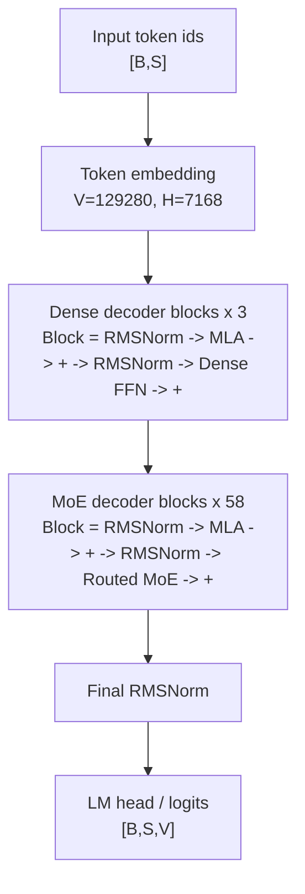
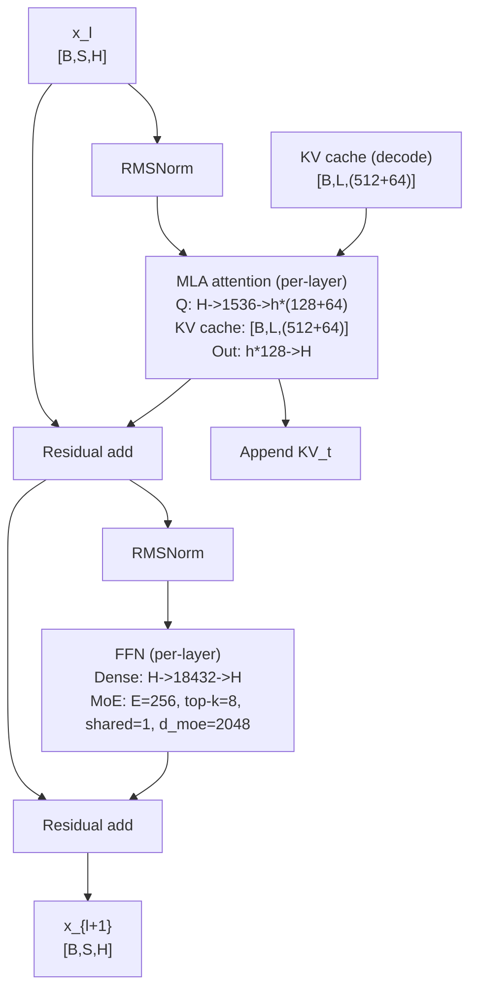
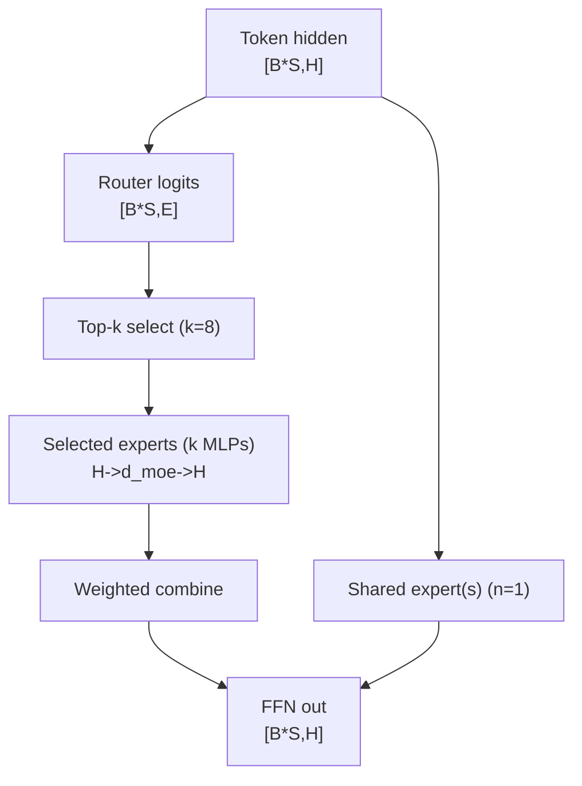
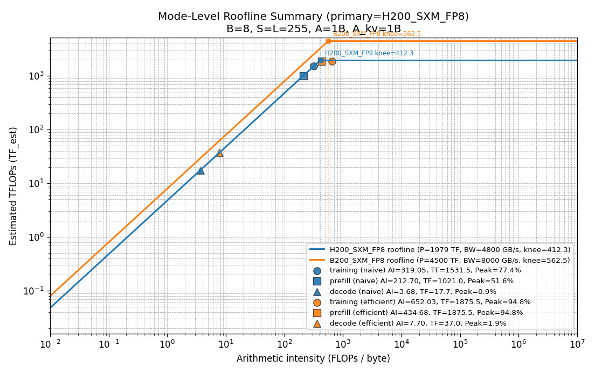
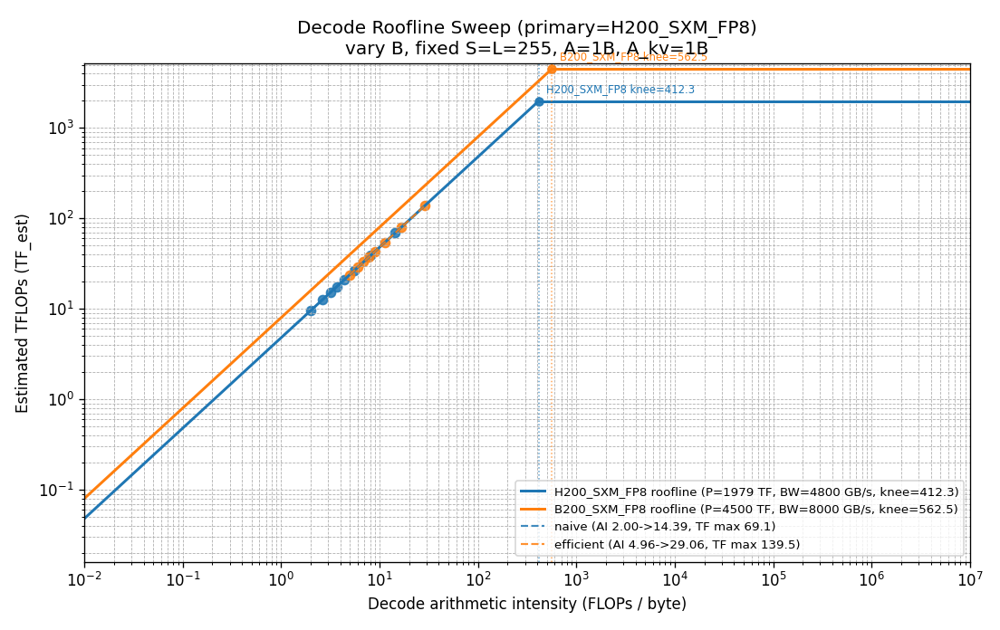
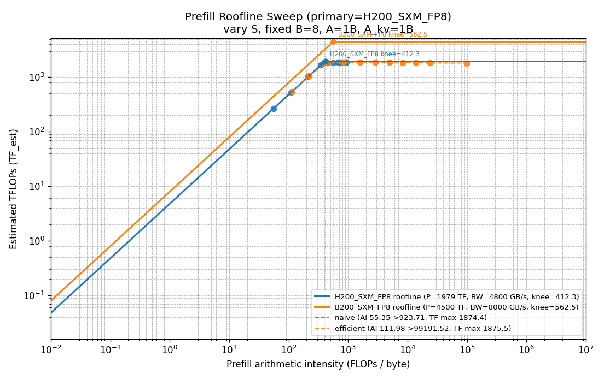
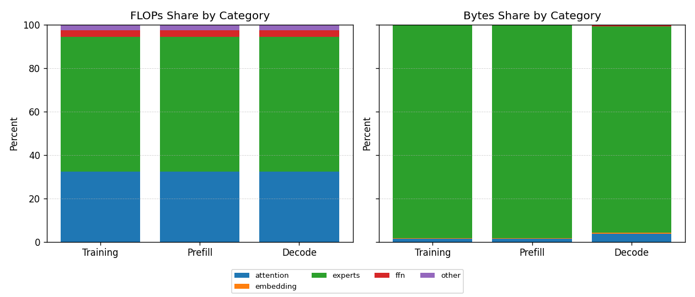
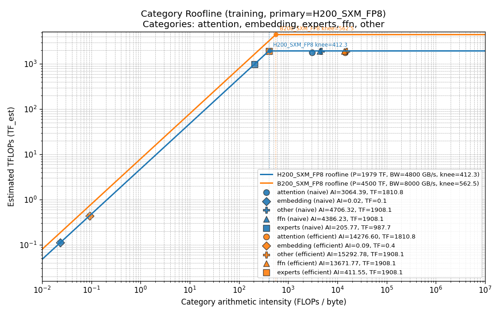
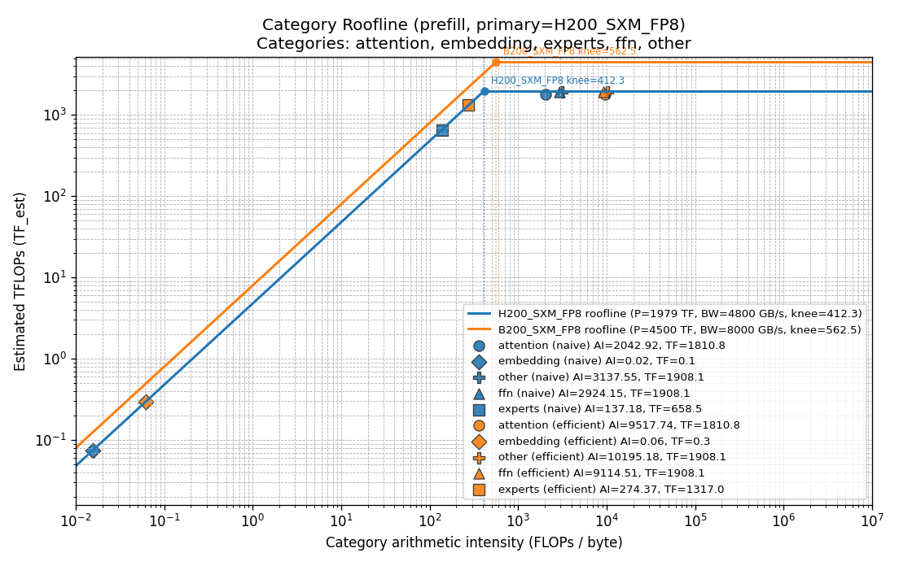
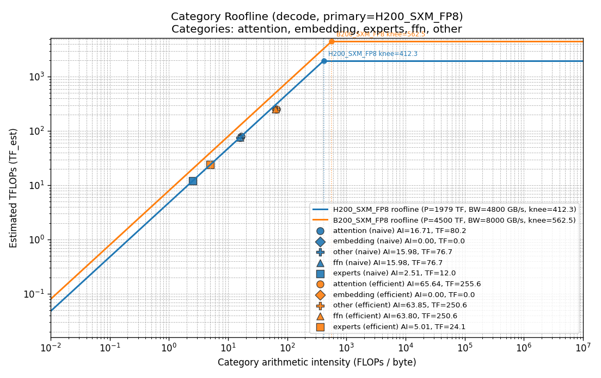

# Model Report

Generated: 2026-02-18 09:13:49

## 1. How to Read This Report

### 1.1. Goal

We want a simple outcome: given a model and a chip target, predict what limits throughput or latency in training, prefill, and decode, and then identify which knobs actually move those limits. We proceed from architecture to math/bytes to roofline to regimes to sensitivity, so each later table has an explicit definition and a reason to exist.

### 1.2. Workflow (3 Steps)

First, we classify the limiting regime by comparing arithmetic intensity to the chip ridge (`OI_knee = P_peak / BW_hbm`) and by inspecting the modeled times `T_comp`, `T_hbm`, and `T_net`. Second, we locate the dominant byte term using the byte decomposition (weights, activations, KV, temporary). Third, we map the regime to an optimization family: compute-bound suggests utilization/fusion; HBM(weight)-bound suggests weight residency/compression; HBM(KV)-bound suggests KV format/dtype/layout; and network-bound suggests topology/compression/overlap.

### 1.3. Common Gotchas

`F_theory` is an algorithmic count; it is not a performance claim. We explicitly separate `F_theory` from `F_realizable` (a peak-equivalent compute cost under a utilization model) because tiny-batch decode and thin GEMMs can leave tensor cores under-saturated. Decode also has a distinct length variable (`L`, KV length), and long-context decode can trend toward KV-driven `~1/L` intensity decline. Finally, MoE dispatch becomes a first-order concern primarily when expert parallelism (`EP`) is greater than 1.

## 2. Key Terms and Units

We use a small chain of definitions throughout the report. We start from `F_theory` (symbolic FLOPs derived from operator shapes, e.g. GEMM `2*M*K*N`) and a byte decomposition (`bytes_weights`, `bytes_activations`, `bytes_kv`, `bytes_temporary`). We then form `AI_hbm = F_theory / bytes_hbm` and convert it into chip ceilings via roofline (`OI_knee = P_peak / BW_hbm`). Separately, we estimate time by combining a compute cost `F_realizable` (peak-equivalent compute cost under utilization assumptions) with HBM/network transfer times and taking `T_est = max(T_comp, T_hbm, T_net)`. Finally, we report estimated throughput as `TF_est = F_theory / T_est` and plot points at (`AI_hbm`, `TF_est`).

| Term | Definition | Units | Where Used |
|---|---|---|---|
| `F_theory` | Symbolic FLOPs from model equations before hardware mapping. | `FLOPs` | Math, KPIs |
| `F_tensorcore` | Tensor-core-eligible subset of FLOPs. | `FLOPs` | Math, KPIs |
| `F_realizable` | Peak-equivalent compute cost FLOPs after utilization model (`eta_tc`) and scalar fallback. | `FLOPs` | Math, KPIs, Roofline |
| `eta_tc(B)` | Tensor-core utilization factor as a function of effective GEMM M dimension (decode proxy: batch). | `ratio` | Math |
| `P_peak` | Chip peak compute throughput. | `TFLOPs` | Roofline |
| `P_effective` | Effective compute ceiling implied by the utilization model (`P_peak * F_theory / F_realizable`). | `TFLOPs` | KPIs |
| `WRF_attn/dense/moe` | Weight Residency Factor(s) (WRF). We model effective streamed weight bytes as `W_eff = W / WRF`, with separate factors for attention/dense/MoE families. | `ratio` | Byte model, KPIs |
| `activation_fusion_factor` | Scales activation/intermediate bytes to represent fewer HBM trips under fused kernels. | `ratio` | Byte model |
| `elementwise_bytes_factor` | Scales elementwise-heavy terms (for example softmax/norm) to represent fusion and reduced temporaries. | `ratio` | Byte model |
| `bytes_weights` | Streamed weight bytes. | `bytes` | Byte model, KPIs |
| `bytes_activations` | Activation input/output bytes. | `bytes` | Byte model, KPIs |
| `bytes_kv` | KV-cache read/write bytes. | `bytes` | Byte model, KPIs |
| `bytes_temporary` | Temporary/intermediate buffer bytes. | `bytes` | Byte model, KPIs |
| `bytes_hbm` | Total HBM bytes = weights + activations + KV + temporary. | `bytes` | Byte model |
| `bytes_net` | Interconnect bytes (for example MoE dispatch). | `bytes` | Byte model, KPIs |
| `AI_hbm` | Arithmetic intensity using HBM bytes (`FLOPs / bytes_hbm`). | `FLOPs/byte` | Roofline, KPIs |
| `AI_total` | Arithmetic intensity using HBM+network bytes. | `FLOPs/byte` | KPIs |
| `OI_knee` | Roofline ridge point (`P_peak / BW_hbm`). | `FLOPs/byte` | Roofline |
| `T_comp` | Compute time estimate. | `seconds` | KPIs |
| `T_hbm` | HBM transfer time estimate. | `seconds` | KPIs |
| `T_net` | Network transfer time estimate. | `seconds` | KPIs |
| `T_est` | Estimated step time (`max(T_comp, T_hbm, T_net)`). | `seconds` | KPIs |
| `TF_est` | Estimated throughput from the time model (`F_theory / T_est`). | `TFLOPs` | Roofline plots, sweeps |

- Term chain: `F_theory -> F_tensorcore -> F_realizable -> AI -> roofline/time limits`.

## 3. Executive Summary

### 3.1. 3 Conclusions

1. In efficient mode, training is `compute-bound` and prefill is `compute-bound` (`AI_hbm`: 652.03, 434.68).
2. Decode remains `hbm-bound` across sampled batches; no `B_crit` crossing was found for `OI_knee=412.3`.
3. Experts hold ~97.8% of parameters, but parameter share does not equal runtime cost share.

### 3.2. 3 Next Optimizations

1. Prioritize weight-stream reduction: raise effective residency (WRF), improve expert weight staging, and reduce streaming bytes.
2. Keep improving compute path: increase tensor-core utilization and fuse bandwidth-heavy elementwise steps.
3. For serving, optimize batching policy around `B_crit` and latency constraints instead of targeting peak TFLOPs alone.

## 4. Architecture Overview

We begin with architecture because it determines where FLOPs and bytes come from before any kernel or system tuning. We focus on MLA and MoE because they reshape attention KV traffic, parameter concentration, and (optionally) dispatch behavior. These choices largely determine whether training, prefill, and decode are compute-, HBM-, or network-limited on a given chip. In the evidence below, we focus on how parameters concentrate in experts (drives weight-residency priorities), how MLA sets KV elements per token (drives decode KV bandwidth), and how the dense-vs-MoE layer mix shifts where bytes and FLOPs concentrate.

> **Callout:** Parameter distribution != runtime cost distribution.

### 4.1. Model Fingerprint

| Property | Value |
|---|---|
| Family | `Transformer` |
| Attention | `MLA` |
| Position Encoding | `RoPE (scaled)` |
| Normalization | `RMSNorm` |
| Activation | `Unknown` |
| MoE | `Detected` |
| Weight Tying | `No` |

**Config**

| Property | Value |
|---|---|
| `hidden_size` | `7168` |
| `num_hidden_layers` | `61` |
| `num_attention_heads` | `128` |
| `num_key_value_heads` | `128` |
| `intermediate_size` | `18432` |
| `moe_intermediate_size` | `2048` |
| `n_routed_experts` | `256` |
| `n_shared_experts` | `1` |
| `num_experts_per_tok` | `8` |
| `first_k_dense_replace` | `3` |
| `moe_layer_freq` | `1` |
| `q_lora_rank` | `1536` |
| `kv_lora_rank` | `512` |
| `qk_nope_head_dim` | `128` |
| `qk_rope_head_dim` | `64` |
| `v_head_dim` | `128` |
| `scoring_func` | `sigmoid` |
| `n_group` | `8` |
| `topk_group` | `4` |
| `vocab_size` | `129280` |
| `max_position_embeddings` | `163840` |
| `dropout` | `0.0` |

### 4.2. Architecture Diagrams







We keep these diagrams schematic: an end-to-end decoder stack, a representative decoder block (residual + MLA + FFN), and the routed MoE dataflow. Dense vs MoE FFN placement is controlled by `first_k_dense_replace` and `moe_layer_freq`.

### 4.3. Parameter & Memory Summary

We summarize parameter counts and memory in two complementary views: the instantiated tensor-dtype footprint (from parameter tensors) and the assumed parameter-byte setting used consistently by the analytic byte model.

| Metric | Value |
|---|---:|
| Total parameters | `671,026,404,352` |
| Trainable parameters | `671,026,404,352` |
| Non-trainable parameters | `0` |
| Parameter memory (tensor dtypes) | `2559762.59 MB` |
| Parameter memory (assumed, 1-byte params) | `639940.65 MB` |

Note: parameters are meta-initialized, so memory is estimated from tensor shapes and dtypes.

**Parameter Category Breakdown**


### 4.4. Module Size Breakdown

Pattern-based view groups repeated layer indices (for example, `blocks.*.attn.out_proj`) to avoid repetitive rows.

| Module Pattern | Instances | Params / Instance | Total Params | % Total | Total Memory (MB) | Example Module |
|---|---:|---:|---:|---:|---:|---|
| `blocks.*.ffn.experts.*.gate_proj` | 14848 | 14,680,064 | 217,969,590,272 | 32.48% | 831488.00 | `blocks.3.ffn.experts.0.gate_proj` |
| `blocks.*.ffn.experts.*.up_proj` | 14848 | 14,680,064 | 217,969,590,272 | 32.48% | 831488.00 | `blocks.3.ffn.experts.0.up_proj` |
| `blocks.*.ffn.experts.*.down_proj` | 14848 | 14,680,064 | 217,969,590,272 | 32.48% | 831488.00 | `blocks.3.ffn.experts.0.down_proj` |
| `blocks.*.attn.out_proj` | 61 | 117,440,512 | 7,163,871,232 | 1.07% | 27328.00 | `blocks.0.attn.out_proj` |
| `blocks.*.attn.q_b_proj` | 61 | 37,748,736 | 2,302,672,896 | 0.34% | 8784.00 | `blocks.0.attn.q_b_proj` |
| `blocks.*.attn.kv_b_proj` | 61 | 16,777,216 | 1,023,410,176 | 0.15% | 3904.00 | `blocks.0.attn.kv_b_proj` |
| `token_embeddings` | 1 | 926,679,040 | 926,679,040 | 0.14% | 3535.00 | `token_embeddings` |
| `lm_head` | 1 | 926,679,040 | 926,679,040 | 0.14% | 3535.00 | `lm_head` |
| `blocks.*.ffn.shared_experts.*.gate_proj` | 58 | 14,680,064 | 851,443,712 | 0.13% | 3248.00 | `blocks.3.ffn.shared_experts.0.gate_proj` |
| `blocks.*.ffn.shared_experts.*.up_proj` | 58 | 14,680,064 | 851,443,712 | 0.13% | 3248.00 | `blocks.3.ffn.shared_experts.0.up_proj` |
| `blocks.*.ffn.shared_experts.*.down_proj` | 58 | 14,680,064 | 851,443,712 | 0.13% | 3248.00 | `blocks.3.ffn.shared_experts.0.down_proj` |
| `blocks.*.attn.q_a_proj` | 61 | 11,010,048 | 671,612,928 | 0.10% | 2562.00 | `blocks.0.attn.q_a_proj` |
| `blocks.*.ffn.gate_proj` | 3 | 132,120,576 | 396,361,728 | 0.06% | 1512.00 | `blocks.0.ffn.gate_proj` |
| `blocks.*.ffn.up_proj` | 3 | 132,120,576 | 396,361,728 | 0.06% | 1512.00 | `blocks.0.ffn.up_proj` |
| `blocks.*.ffn.down_proj` | 3 | 132,120,576 | 396,361,728 | 0.06% | 1512.00 | `blocks.0.ffn.down_proj` |
| `blocks.*.attn.kv_a_proj` | 61 | 4,128,768 | 251,854,848 | 0.04% | 960.75 | `blocks.0.attn.kv_a_proj` |
| `blocks.*.ffn.router` | 58 | 1,835,008 | 106,430,464 | 0.02% | 406.00 | `blocks.3.ffn.router` |
| `blocks.*.attn_norm` | 61 | 7,168 | 437,248 | 0.00% | 1.67 | `blocks.0.attn_norm` |
| `blocks.*.ffn_norm` | 61 | 7,168 | 437,248 | 0.00% | 1.67 | `blocks.0.ffn_norm` |
| `blocks.*.attn.q_a_norm` | 61 | 1,536 | 93,696 | 0.00% | 0.36 | `blocks.0.attn.q_a_norm` |
... 2 more patterns

### 4.5. Weight Statistics (Top 20 Layers)

- Weight value statistics are unavailable for meta-initialized parameters (no backing storage).

## 5. Analytical Model (FLOPs, Bytes, Time)

We define an analytical model that turns architecture into symbolic FLOPs, explicit bytes, and a static time estimate. We separate algorithmic work (`F_theory`) from a utilization-aware compute cost (`F_realizable`) and combine compute, HBM, and network times into `T_est` so later TFLOPs are not misread as measured performance. All roofline points and regime tables in the report are derived from this chain, so this section is the contract and audit trail for the numbers that follow. In the evidence below, we focus on the full definition chain `F_theory -> F_tensorcore -> F_realizable -> (AI_hbm, T_est) -> TF_est`, execution assumptions (WRF, fusion, flash attention) that change bytes without changing algorithms, and byte accounting and dominance tests that drive optimization conclusions.

### 5.1. Modeling intent and scope

The model is static: it does not ingest runtime profiler timelines, scheduler queues, or overlap traces. Its role is to rank bottlenecks and optimization priorities, not to claim measured peak attainment. The core mapping is `F_theory` (symbolic FLOPs from formulas) -> `F_tensorcore` (tensor-core-eligible FLOPs) -> `F_realizable` (peak-equivalent compute cost after utilization model), combined with `bytes_hbm` (HBM byte total) decomposition and `AI_hbm` (FLOPs divided by HBM bytes) / `AI_total` (FLOPs divided by HBM+network bytes) to determine roofline and timing outcomes. We use `AI_hbm` relative to `OI_knee` (ridge intensity `P_peak / BW_hbm`) to describe which side of the roofline ridge a point lies on, but the `Regime` labels in KPI tables come from the time model (`T_est` (estimated step time from compute/memory/network times) as `max(T_comp, T_hbm, T_net)`).

**Sanity checks.** As batch `B` grows, GEMM FLOPs scale with `B` while some weight bytes are amortized, so arithmetic intensity typically rises. In decode, KV read bytes scale with `L`; once KV dominates, intensity tends toward a `~1/L` decline.

### 5.2. Notation

| Symbol | Meaning |
|---|---|
| `B` | microbatch size per GPU |
| `S` | prefill sequence length |
| `L` | decode KV-cache length |
| `H` | hidden size |
| `h` | attention head count |
| `In`, `Out` | linear input/output channel size |
| `D` | embedding width |
| `W` | raw module weight bytes |
| `W_eff = W / WRF` | effective streamed weight bytes |
| `A` | activation bytes/element |
| `A_kv` | KV-cache bytes/element |
| `C_kv` | KV-cache elements per token |
| `F_theory` | mathematical FLOPs from symbolic formulas |
| `F_tensorcore` | tensor-core-eligible FLOPs subset |
| `F_realizable` | peak-equivalent compute cost after utilization/scalar-efficiency model |
| `eta_tc(B)=min(1,M_eff/B_sat)` | tensor-core saturation factor (proxy: decode uses `M_eff≈B`; dense prefill/training uses `M_eff≈B*S`) |
| `P_effective = P_peak * F_theory / F_realizable` | effective compute ceiling implied by utilization model |
| `AI_hbm = FLOPs / bytes_hbm` | HBM arithmetic intensity |
| `AI_total = FLOPs / (bytes_hbm + bytes_net)` | end-to-end intensity |
| `T_comp = F_realizable / P_peak` | compute time estimate |
| `T_hbm = bytes_hbm / BW_hbm` | HBM time estimate |
| `T_net = bytes_net / BW_net` | network time estimate |
| `T_est = max(T_comp, T_hbm, T_net)` | step-time upper bound |

### 5.3. Execution / Kernel Assumptions

These are conservative knobs for sensitivity analysis, not claims about measured kernel reuse.

| exec_model | attention bytes | WRF attn/dense/moe | act fusion | elementwise |
|---|---|---|---:|---:|
| `naive` | `naive` | `1.00/1.00/1.00` | 1.00 | 1.00 |
| `efficient` | `flash` | `4.00/4.00/2.00` | 0.50 | 0.70 |

#### 5.3.1. Knob Semantics and Rationale

We introduce a small set of execution-mode knobs to express how kernel families change HBM traffic without changing the underlying algorithm. `WRF` (Weight Residency Factor) models effective streamed weights as `W_eff = W / WRF`, and we use separate factors for attention/dense/MoE because reuse differs by module family. `act fusion` scales activation/intermediate bytes to represent fewer HBM trips under fused kernels, while `elementwise` scales elementwise-heavy terms (softmax/norm/masking temporaries). Finally, `attention bytes` selects the attention byte path: `naive` materializes score/prob matrices in HBM, while `flash` removes most `SxS` temporary traffic while still counting explicit KV reads and writes.

These are conservative knobs for sensitivity analysis, not claims about measured kernel reuse. We treat `naive` as a pessimistic baseline (`WRF=1`, no fusion) and `efficient` as a conservative approximation of common optimizations (partial residency + fusion). If you have measured counters in your serving/training stack, tune these factors to match observed bytes and regenerate the report.

### 5.4. Per-Module Formulas

We use GEMM as the primitive building block: multiplying `[M,K] @ [K,N]` costs `2*M*K*N` FLOPs. For any module, we combine its FLOP model with its byte model to form `AI_hbm`, and we call a point compute-favorable when `AI_hbm >= OI_knee` (with `OI_knee = P_peak / BW_hbm`).

| Module | Shape Explanation | Sample Torch | FLOPs | Bytes (HBM, naive) | Native AI | Efficient AI | Note |
|---|---|---|---|---|---|---|---|
| Linear prefill | `X:[B,S,In] @ W:[In,Out] -> Y:[B,S,Out]` | `y = x @ w` | `2*B*S*In*Out` | `W + A*(B*S*In + B*S*Out)` | `F / Bytes_naive` | `F / (W/WRF_dense + A*act_fusion*(B*S*In + B*S*Out))` | `Usually modest vs native unless WRF or fusion is high` |
| Linear decode | `X:[B,In] @ W:[In,Out] -> Y:[B,Out]` | `y = x @ w` | `2*B*In*Out` | `W + A*(B*In + B*Out)` | `F / Bytes_naive` | `F / (W/WRF_dense + A*act_fusion*(B*In + B*Out))` | `Typically similar; weight reuse is limited in decode` |
| Embedding prefill | `ids:[B,S] -> out:[B,S,D]` from `table:[V,D]` | `out = table[ids]` | `B*S*D` | `W + A*(B*S*D)` | `F / Bytes_naive` | `F / (W/WRF_dense + A*act_fusion*(B*S*D))` | `Usually close; dominated by table read` |
| Embedding decode | `ids:[B] -> out:[B,D]` from `table:[V,D]` | `out = table[ids]` | `B*D` | `W + A*(B*D)` | `F / Bytes_naive` | `F / (W/WRF_dense + A*act_fusion*(B*D))` | `Close to native; little activation reuse` |
| Attention prefill | `Q,K,V:[B,h,S,d]`, score `[B,h,S,S]`, context `[B,h,S,d]` | `p=softmax(q@kT); y=p@v` | `8*B*S*H^2 + 4*B*S^2*H + B*h*S^2` | `W + A*(B*S*H + 3*B*S*H + 2*B*h*S^2 + B*S*H) + A_kv*(B*S*C_kv)` | `F / Bytes_naive` | `F / (W/WRF_attn + A*(core_terms) + A_kv*(B*S*C_kv))` (flash removes SxS HBM materialization) | `Often much higher vs native when S is large` |
| Attention decode | `Q:[B,h,1,d]`, cache `K,V:[B,h,L,d]`, score `[B,h,1,L]` | `p=softmax(q@kT); y=p@v` | `8*B*H^2 + 4*B*L*H + B*h*L` | `W + A*(B*H + 3*B*H + 2*B*h*L + B*H + 2*B*H) + A_kv*(B*L*C_kv + B*C_kv)` | `F / Bytes_naive` | `F / (W/WRF_attn + A*(core_terms) + A_kv*(B*L*C_kv + B*C_kv))` | `Usually limited by KV reads; efficient ~= native` |

Footnotes:
- `C_kv` mapping: standard MHA/GQA uses K/V cache in head space; DeepSeek-MLA uses `kv_lora_rank + qk_rope_head_dim`.
- Attention formulas above are generic dense attention references; module-level MLA estimates use detected dims (`r_q`, `r_kv`, `d_nope`, `d_rope`, `d_v`) in `_compute_attention_flops_*_mla`.
- Training maps from prefill: `F_train = F_prefill * training_flops_multiplier`, `bytes_train = bytes_prefill * training_bytes_multiplier`.

### 5.5. Tensor Core Mapping

Tensor cores deliver their advertised throughput only when GEMM shapes provide enough parallel work and pack well into hardware tiles. In decode, GEMMs often have a small effective M dimension (roughly the microbatch `B`), while dense prefill/training GEMMs have `M≈B*S` and MoE expert GEMMs have `M≈(tokens per active expert)`. We model tensor-core saturation with `eta_tc(B)=min(1, M_eff/B_sat)` (the symbol uses `B` for historical decode intuition; the implementation uses `M_eff`). We then define a peak-equivalent compute cost as `F_realizable = F_tensorcore/eta_tc + (F_theory-F_tensorcore)/eta_scalar`, so that `T_comp = F_realizable / P_peak` is consistent without double-counting utilization.

### 5.6. Byte Accounting

`bytes_hbm = bytes_weights + bytes_activations + bytes_kv + bytes_temporary`
For routed MoE, `bytes_weights` is not scaled linearly by `top_k`: we approximate expert weight traffic by the expected number of *distinct* experts activated in the microbatch (uniform routing baseline), because weight reads occur per active expert.

| Byte Term | Meaning |
|---|---|
| `bytes_weights` | Streamed weight traffic after residency factor (WRF) |
| `bytes_activations` | Input/output activation movement |
| `bytes_kv` | KV-cache read/write traffic (`L` for decode, `S` write for prefill) |
| `bytes_temporary` | Score/prob/intermediate temporary buffers |

### 5.7. Byte Dominance Test

`share(x) = bytes_x / bytes_hbm`

Decision rules: if `share(weights) > 70%`, we prioritize weight residency/compression/paging; if `share(kv) > 30%` and grows with `L`, we prioritize KV dtype/layout/cache; and if `share(temporary)` is large only in naive attention, we prioritize flash/fused attention.

| Mode | weights naive | kv naive | temp naive | weights eff | kv eff | temp eff |
|---|---:|---:|---:|---:|---:|---:|
| `training` | 93.9% | 0.0% | 1.1% | 94.9% | 0.0% | 0.0% |
| `prefill` | 93.9% | 0.0% | 1.1% | 94.9% | 0.0% | 0.0% |
| `decode` | 99.8% | 0.0% | 0.0% | 99.8% | 0.1% | 0.0% |

In this run, prefill temporary-byte share drops from `1.1%` (naive) to `0.0%` (efficient), which is the intended effect of switching from score/prob materialization to flash-style attention. Decode in efficient mode has a byte mix of weights `99.8%`, KV `0.1%`, and temporary `0.0%`. If decode appears weight-dominant here, that reflects residency assumptions (WRF/paging strategy) and can shift under continuous batching; decode is often KV-bound in literature, and this static model can show either KV or weight-stream dominance depending on those assumptions.

### 5.8. Mode Byte Decomposition (naive vs efficient)

| Mode | bytes_weights naive | bytes_activations naive | bytes_kv naive | bytes_temporary naive | bytes_hbm naive | bytes_weights eff | bytes_activations eff | bytes_kv eff | bytes_temporary eff | bytes_hbm eff |
|---|---:|---:|---:|---:|---:|---:|---:|---:|---:|---:|
| `training` | 1.22 TB | 66.20 GB | 136.71 MB | 15.13 GB | 1.30 TB | 618.21 GB | 33.10 GB | 136.71 MB | 21.27 MB | 651.47 GB |
| `prefill` | 624.94 GB | 33.10 GB | 68.36 MB | 7.57 GB | 665.68 GB | 309.10 GB | 16.55 GB | 68.36 MB | 10.63 MB | 325.73 GB |
| `decode` | 150.65 GB | 139.60 MB | 68.62 MB | 30.38 MB | 150.88 GB | 71.96 GB | 69.80 MB | 68.62 MB | 42.70 KB | 72.10 GB |

## 6. Roofline Analysis

We combine roofline ceilings with the static time model to explain regimes across training, prefill, and decode. We plot points at (`AI_hbm`, `TF_est`) and use `T_est=max(T_comp, T_hbm, T_net)` to identify the limiting resource without claiming measured performance. Sweeps over batch and prompt/KV length then show which knobs can move decode toward the ridge and which cannot under the model assumptions. In the evidence below, we focus on how the anchor workload (`B`, `S`, `L`) sets the base point for reported KPIs, whether phases are left/right of ridge and which time term dominates, and how batch and sequence/KV-length sweeps shift `AI_hbm` and `TF_est`.

### 6.1. Reading a Roofline Point

A roofline point is positioned by its arithmetic intensity and its estimated throughput. The roofline bound is the minimum of the compute ceiling (`P_peak`) and the memory ceiling (`BW_hbm * AI_hbm`). Points left of the ridge (`AI_hbm < OI_knee`) are bounded by HBM, while points right of the ridge are bounded by compute.
This ridge-side classification is a roofline diagnostic; the `Regime` labels in KPI tables come from the time model (`T_est=max(T_comp,T_hbm,T_net)`).

For this run (efficient mode, primary target `H200_SXM_FP8`), decode has `AI_hbm=7.70` compared to `OI_knee=412.29`, so it is `memory-bound` under the HBM roofline model.
Prefill has `AI_hbm=434.68` compared to `OI_knee=412.29`, so it is `compute-bound` under the same assumptions.

### 6.2. Configuration & Assumptions

We evaluate roofline points at an anchor workload defined by the caller-provided `batch_size` and `seq_len` arguments to `dump_model_info(...)`. In `examples/train_deepseek.py`, this corresponds to the training microbatch (`config.training.batch_size`) and the dataset/training context length (`config.data.max_seq_length - 1`). We set decode KV length `L=seq_len` in the decode batch sweep only to isolate batch effects; other sections vary `S` or `L` explicitly (prefill sweep varies `S`; sensitivity varies `L`). To change the anchor, pass different `batch_size`/`seq_len` or override the sweep lists.

| Property | Value |
|---|---|
| Batch size (`B`) | `8` |
| Prefill sequence length (`S`) | `255` |
| Decode KV length (`L`) | `255` |
| Assumed parameter bytes (`W` dtype) | `1` (FP8 default) |
| Activation dtype bytes (`A`) | `1` |
| KV-cache dtype bytes (`A_kv`) | `1` |
| Tensor parallel size (`TP`) | `1` |
| Expert parallel size (`EP`) | `1` |
| Routed experts per GPU (`E/EP`) | `256` |
| Training FLOPs multiplier | `3.0` |
| Training bytes multiplier | `2.0` |
| Primary roofline target | `H200_SXM_FP8` |
| Primary peak compute (`P_peak`) | `1979.0 TFLOPs` |
| HBM bandwidth (`BW_hbm`) | `4800 GB/s` |
| Interconnect bandwidth (`BW_net`) | `900 GB/s` |
| HBM ridge (`OI_knee`) | `412.292 FLOP/byte` |
| Network ridge (`OI_net`) | `2198.889 FLOP/byte` |
| Decode batch sweep | `[1, 2, 4, 8, 16, 32, 64, 128]` |
| Prefill sequence sweep | `[64, 128, 256, 512, 1024, 2048, 4096, 8192, 16384, 32768, 163840]` |
| Requested roofline x-limits | `None` |
| Requested roofline y-limits | `None` |
| Rendered roofline x-limits | `(0.01, 10000000)` |
| Rendered roofline y-limits | `(0.016, 5175.0)` |
| Roofline label mode | `minimal` |

**Roofline Targets (FP8 Dense)**

| Chip | Peak TFLOPs | HBM GB/s | OI_knee (FLOP/byte) |
|---|---:|---:|---:|
| `H200_SXM_FP8` | 1979.0 | 4800 | 412.292 |
| `B200_SXM_FP8` | 4500.0 | 8000 | 562.500 |

### 6.3. Roofline Overview

Model points use the primary target assumptions above and are plotted at (`AI_hbm`, `TF_est`), where `TF_est = F_theory / T_est`. Chip curves show multi-chip roofline upper bounds (memory slope + compute ceiling) for comparison.



**Interpretation**

Efficient training/prefill intensities (`652.03`, `434.68`) should be read against `OI_knee=412.29` to classify regime, while decode (`AI_hbm=7.70`) indicates whether the serving path is still memory-limited under base assumptions. This figure should not be interpreted as parameter share implying runtime share.

### 6.4. Derivation Notes

We include this short note to keep the length variables unambiguous: prefill is parameterized by prompt length `S`, while decode is parameterized by KV-cache length `L`. This matters because different terms dominate: naive prefill attention can incur `O(S^2)` score/prob traffic, while decode attention is driven by `O(L)` KV reads and a small per-step compute core. We therefore plot rooflines using `AI_hbm` (HBM-only) as the x-axis and treat network effects separately via `bytes_net` and `T_net` inside `T_est=max(T_comp,T_hbm,T_net)`. The sweeps below vary one axis at a time (`B` for decode, `S` for prefill) so changes in `AI_hbm` and `TF_est` can be interpreted causally under the stated assumptions.

### 6.5. Why regimes differ across training/prefill/decode

Training and prefill are dominated by larger GEMMs with higher reuse, so they more often approach compute-side behavior under efficient kernels. Decode operates with smaller-M matmuls and explicit KV reads that scale with context length `L`, which keeps decode sensitive to memory traffic even when batch increases. The practical implication is that prefill optimization responds strongly to fusion and tensor-core utilization, while decode optimization is usually governed by byte traffic management and batching policy.

### 6.6. Execution Models (Naive vs Efficient)

This section compares execution modes through one consolidated matrix. The main claim is that mode shifts are primarily byte-path shifts: `F_theory` is stable while `bytes_hbm`, `AI_hbm`, and `T_est` move materially. Evidence comes from model-level KPIs and category-level AI deltas; limitations remain static-analysis assumptions around residency and fusion.

#### 6.6.1. Regime KPI Matrix (naive vs efficient)

We summarize each phase and execution mode with one row of modeled work, bytes, and time. `F_realizable` is the peak-equivalent FLOP cost used for compute time (`T_comp = F_realizable / P_peak`), while `AI_hbm` is the roofline x-coordinate (`F_theory / bytes_hbm`) and `TF_est` is derived later as `F_theory / T_est`. `Regime` is the max-time limiter (`argmax(T_comp,T_hbm,T_net)`), so it can differ from the ridge-side diagnostic (`AI_hbm` vs `OI_knee`). Tokens/s is computed per GPU with `tokens_per_step=B*S` for training/prefill and `tokens_per_step=B` for decode.

| Mode | Exec | F_realizable | bytes_hbm | AI_hbm | MFU_est | T_est (ms) | Tokens/s | Regime |
|---|---|---:|---:|---:|---:|---:|---:|---|
| `training` | `naive` | 481.25 TF | 1.30 TB | 3.191e+02 | 7.739e-01 | 297.818 | 6849.82 | `hbm-bound` |
| `training` | `efficient` | 481.25 TF | 651.47 GB | 6.520e+02 | 9.477e-01 | 243.181 | 8388.82 | `compute-bound` |
| `prefill` | `naive` | 160.42 TF | 665.68 GB | 2.127e+02 | 5.159e-01 | 148.909 | 13699.63 | `hbm-bound` |
| `prefill` | `efficient` | 160.42 TF | 325.73 GB | 4.347e+02 | 9.477e-01 | 81.060 | 25166.45 | `compute-bound` |
| `decode` | `naive` | 13.37 TF | 150.88 GB | 3.680e+00 | 8.926e-03 | 33.752 | 237.02 | `hbm-bound` |
| `decode` | `efficient` | 13.37 TF | 72.10 GB | 7.702e+00 | 1.868e-02 | 16.127 | 496.05 | `hbm-bound` |

#### 6.6.2. Category Delta Overview (naive vs efficient)

We group module entries into coarse categories (`attention`, `experts`, `ffn`, `embedding`, `other`) to explain which operator families drive the deltas between `naive` and `efficient`. For each mode and category we recompute `AI_hbm` from aggregated `F_theory` and `bytes_hbm`, and we report `bytes_total` as HBM+network attribution. With `EP=1` at the anchor workload, network bytes are ~0 and `bytes_total` is dominated by HBM terms; when `EP>1`, routed-MoE dispatch/collect can make the network term material.

| Mode | Category | AI_hbm naive | AI_hbm eff | AI delta % | bytes_total naive | bytes_total eff |
|---|---|---:|---:|---:|---:|---:|
| `training` | `attention` | 3.064e+03 | 1.428e+04 | 365.9% | 44.83 GB | 9.62 GB |
| `training` | `embedding` | 2.330e-02 | 9.178e-02 | 293.9% | 1.75 GB | 455.82 MB |
| `training` | `experts` | 2.058e+02 | 4.115e+02 | 100.0% | 1.25 TB | 639.72 GB |
| `training` | `ffn` | 4.386e+03 | 1.367e+04 | 211.7% | 3.09 GB | 1015.24 MB |
| `training` | `other` | 4.706e+03 | 1.529e+04 | 224.9% | 2.24 GB | 707.33 MB |
| `prefill` | `attention` | 2.043e+03 | 9.518e+03 | 365.9% | 22.42 GB | 4.81 GB |
| `prefill` | `embedding` | 1.553e-02 | 6.119e-02 | 293.9% | 897.70 MB | 227.91 MB |
| `prefill` | `experts` | 1.372e+02 | 2.744e+02 | 100.0% | 639.72 GB | 319.86 GB |
| `prefill` | `ffn` | 2.924e+03 | 9.115e+03 | 211.7% | 1.55 GB | 507.62 MB |
| `prefill` | `other` | 3.138e+03 | 1.020e+04 | 224.9% | 1.12 GB | 353.67 MB |
| `decode` | `attention` | 1.671e+01 | 6.564e+01 | 292.9% | 10.75 GB | 2.74 GB |
| `decode` | `embedding` | 6.188e-05 | 2.475e-04 | 300.0% | 883.80 MB | 220.96 MB |
| `decode` | `experts` | 2.507e+00 | 5.013e+00 | 100.0% | 137.30 GB | 68.65 GB |
| `decode` | `ffn` | 1.598e+01 | 6.380e+01 | 299.4% | 1.11 GB | 284.38 MB |
| `decode` | `other` | 1.598e+01 | 6.385e+01 | 299.5% | 884.79 MB | 221.46 MB |

#### 6.6.3. Cross-Mode Summary (naive vs efficient)

We provide a compact scanline across phases (training vs prefill vs decode) to make cross-mode comparisons easy. This is the fastest way to see whether an execution mode mainly changes bytes (`AI_hbm`) or whether it materially changes modeled time (`T_est`) and throughput (Tokens/s). In practice, prefill often benefits more from byte reductions (especially attention temporaries) than decode, which can remain constrained by streaming terms and small effective batch.

| Mode | AI_hbm naive | AI_hbm eff | T_est naive (ms) | T_est eff (ms) | Tokens/s naive | Tokens/s eff |
|---|---:|---:|---:|---:|---:|---:|
| `training` | 3.191e+02 | 6.520e+02 | 297.818 | 243.181 | 6849.82 | 8388.82 |
| `prefill` | 2.127e+02 | 4.347e+02 | 148.909 | 81.060 | 13699.63 | 25166.45 |
| `decode` | 3.680e+00 | 7.702e+00 | 33.752 | 16.127 | 237.02 | 496.05 |

#### 6.6.4. Decode Batch Sweep - Model-Level (naive vs efficient)

We sweep decode microbatch `B` while holding KV length `L` fixed to the anchor `seq_len`, so we isolate the effect of batching on amortization and the utilization model. We keep parallelism fixed to the configuration in 6.2 (`TP`/`EP`), which fixes the per-GPU routed expert set (`E/EP`) and therefore the expert weight-streaming model. Each row reports `AI_hbm` and `T_est` for both execution modes, and `Regime` is computed from the time model (`argmax(T_comp,T_hbm,T_net)`). For roofline intuition we also report `B_crit`, the first batch (interpolated) where `AI_hbm` crosses the HBM ridge; this ridge-side diagnostic can disagree with the time-model regime when utilization effects dominate.

`B_crit` at HBM ridge (`AI_hbm = OI_knee=412.29`): naive=`None`, efficient=`None`.

| Batch | AI_hbm naive | AI_hbm eff | T_est naive (ms) | T_est eff (ms) | TF_est naive | TF_est eff | Regime naive | Regime eff |
|---:|---:|---:|---:|---:|---:|---:|---|---|
| 1 | 2.000e+00 | 4.961e+00 | 7.764 | 3.130 | 9.60 | 23.81 | `hbm-bound` | `hbm-bound` |
| 2 | 2.624e+00 | 6.013e+00 | 11.833 | 5.165 | 12.60 | 28.86 | `hbm-bound` | `hbm-bound` |
| 4 | 3.169e+00 | 6.863e+00 | 19.600 | 9.049 | 15.21 | 32.94 | `hbm-bound` | `hbm-bound` |
| 8 | 3.680e+00 | 7.702e+00 | 33.752 | 16.127 | 17.66 | 36.97 | `hbm-bound` | `hbm-bound` |
| 16 | 4.337e+00 | 8.906e+00 | 57.273 | 27.892 | 20.82 | 42.75 | `hbm-bound` | `hbm-bound` |
| 32 | 5.527e+00 | 1.124e+01 | 89.889 | 44.208 | 26.53 | 53.94 | `hbm-bound` | `hbm-bound` |
| 64 | 8.160e+00 | 1.651e+01 | 121.777 | 60.169 | 39.17 | 79.27 | `hbm-bound` | `hbm-bound` |
| 128 | 1.439e+01 | 2.906e+01 | 138.136 | 68.382 | 69.06 | 139.50 | `hbm-bound` | `hbm-bound` |

**How These Numbers Are Calculated**

We compute each row by aggregating model-level FLOPs and bytes under fixed parallelism, then evaluating the static time model and derived roofline diagnostics. Decode batch sweep varies `B` only. Decode KV length is fixed at `L=255` for all rows to isolate batch effects (the sensitivity sweep varies `L` explicitly). The calculation chain is:

```text
F_theory(B,L,m) = sum_i F_i(B,L,m)
bytes_hbm(B,L,m) = sum_i (bytes_weights_i + bytes_activations_i + bytes_kv_i + bytes_temporary_i)
bytes_net(B,L,m) = sum_i bytes_net_i
AI_hbm = F_theory / bytes_hbm
T_comp = F_realizable / (P_peak * 1e12)
T_hbm = bytes_hbm / (BW_hbm * 1e9)
T_net = bytes_net / (BW_net * 1e9)
T_est = max(T_comp, T_hbm, T_net)
regime = argmax{T_comp, T_hbm, T_net}
TF_est = F_theory / T_est / 1e12
TF_roofline_hbm = min(P_peak, BW_hbm * AI_hbm / 1e12)
```

- Worked example (efficient, `B=128`, fixed `L=255`):
  `F_theory=9.539e+12`, `bytes_hbm=3.282e+11`, so `AI_hbm=2.906e+01`.
  Ridge check: `AI_hbm < OI_knee` -> `2.906e+01 < 4.123e+02`.
  Roofline upper bound: `BW_hbm * AI_hbm / 1e12 = 139.50 TFLOPs`; `TF_roofline_hbm = min(P_peak, unclipped) = min(1979.00, 139.50) = 139.50 TFLOPs`.
  Time path: `T_comp=12.568 ms`, `T_hbm=68.382 ms`, `T_net=0.000 ms`, `T_est=68.382 ms` -> regime `hbm-bound`.
  Estimated throughput: `TF_est = F_theory / T_est / 1e12 = 139.50 TFLOPs`.



**Interpretation**

Decode AI rises with batch at fixed `L`, but the operational takeaway is whether `B_crit=None` is reachable under latency constraints. If practical serving batch stays below this threshold at `OI_knee=412.29`, decode remains memory-limited despite better throughput-mode points.

#### 6.6.5. Prefill Sequence Sweep - Model-Level (naive vs efficient)

We sweep prefill prompt length `S` while holding per-GPU microbatch `B` and the parallelism assumptions fixed (`TP=1`, `EP=1`), so the per-GPU expert set and per-GPU token count are well-defined. This isolates how sequence length changes reuse and temporary traffic in attention: in `naive`, attention has explicit `O(S^2)` score/prob materialization, while `flash`-style kernels reduce this temporary traffic. Meanwhile, weight bytes are comparatively insensitive to `S`, so longer prompts tend to amortize weight streaming and increase `AI_hbm` until other terms dominate. In the table below, we look for where `AI_hbm` crosses the ridge and where `T_est` stops improving, which indicates that prefill has transitioned from being HBM-limited to being compute- or utilization-limited under the model.

| Sequence | AI_hbm naive | AI_hbm eff | T_est naive (ms) | T_est eff (ms) | TF_est naive | TF_est eff |
|---:|---:|---:|---:|---:|---:|---:|
| 64 | 5.535e+01 | 1.120e+02 | 141.766 | 70.079 | 265.70 | 537.50 |
| 128 | 1.095e+02 | 2.220e+02 | 143.948 | 71.013 | 525.63 | 1065.49 |
| 256 | 2.135e+02 | 4.363e+02 | 148.952 | 81.384 | 1024.75 | 1875.54 |
| 512 | 4.005e+02 | 8.444e+02 | 165.666 | 165.666 | 1874.41 | 1874.41 |
| 1024 | 6.794e+02 | 1.591e+03 | 342.924 | 342.924 | 1872.26 | 1872.26 |
| 2048 | 9.237e+02 | 2.878e+03 | 732.218 | 732.218 | 1868.37 | 1868.37 |
| 4096 | 9.200e+02 | 4.965e+03 | 1649.915 | 1649.915 | 1861.90 | 1861.90 |
| 8192 | 7.341e+02 | 8.269e+03 | 4041.747 | 4041.747 | 1852.53 | 1852.53 |
| 16384 | 5.576e+02 | 1.376e+04 | 11051.162 | 11051.162 | 1841.34 | 1841.34 |
| 32768 | 4.462e+02 | 2.368e+04 | 33972.996 | 33972.996 | 1830.68 | 1830.68 |
| 163840 | 3.467e+02 | 9.919e+04 | 703555.074 | 644691.851 | 1664.13 | 1816.08 |



**Interpretation**

Prefill trends toward higher AI as sequence grows, and efficient kernels reduce temporary-byte pressure, so prefill often reaches compute-favorable operation earlier than decode. This does not imply decode will share the same regime at matched model size.

#### 6.6.6. Mode Share Overview (naive vs efficient)

We visualize category shares to separate "where parameters live" from "what limits runtime" under this analytic model. Here, a "share" is computed from the modeled totals: FLOPs share is a fraction of `F_theory`, and bytes share is a fraction of `bytes_total` (HBM plus any network attribution), both aggregated per category. We report shares per GPU under the fixed parallelism setting (`TP=1`, `EP=1`), so the MoE expert set per GPU (`E/EP`) and dispatch attribution are consistent with the KPIs. This plot exists to prevent the common MoE fallacy: experts can dominate parameters while attention/KV or other streaming terms dominate runtime.




#### 6.6.7. Category Roofline (Per Mode)

We aggregate entries by category and plot category-level points at (`AI_hbm`, `TF_est`) using the same time model as the mode-level KPIs. This view isolates which operator family is left of ridge (HBM-limited) versus right of ridge (compute-side) in each phase, and it helps explain why a phase-level regime label changes (or does not) when switching between `naive` and `efficient`.

**Training**



**Prefill**



**Decode**



**Interpretation**

Category rooflines separate operator families by where their FLOPs and bytes come from. In decode, attention often sits at lower `AI_hbm` because KV reads grow with `L`, while GEMM-heavy categories (dense/experts) can sit closer to the compute side if weight streaming is sufficiently amortized. Importantly, parameter share does not imply runtime share; the bytes/FLOPs mix determines the regime.


### 6.7. Decode Compute-Bound Exploration (DP=EP, TP=1)

We answer a feasibility question for decode: for a given expert-parallel size `EP` and KV-cache length `L`, can decode ever become compute-limited under the same static model used elsewhere in this report, and if so what per-GPU microbatch `B_g` would be required. We define `B_g` as the microbatch processed by one GPU under the simplifying assumption `DP=EP` with `TP=1`, so increasing `EP` reduces the routed expert set per GPU to `ceil(E/EP)` but can introduce network dispatch. We compute ridge intensities from the hardware target (`OI_hbm=412.3`, `OI_net=2198.9`, BW_net=900 GB/s) and then search for the smallest `B_g` such that `T_comp >= alpha*max(T_hbm,T_net)` with `alpha=0.90`.

Assumptions:
- `DP=EP`, `TP=1`, no PP/SP; all quantities are interpreted per GPU.
- Routed experts per GPU: `ceil(E/EP)` with `E=256` and `top_k=8`.
- We reuse the same time model terms (`T_comp`, `T_hbm`, `T_net`) and treat a setting as compute-favorable when `T_comp` is within `alpha` of the slower of HBM and network.

How to read the table: `OI_inf_hbm(L)` is the asymptotic HBM arithmetic intensity as `B_g→∞` where weight terms amortize and KV reads dominate; if this asymptote is below the HBM ridge, no batch can make decode compute-limited for that `L`. `OI_net` is a similar diagnostic against the network ridge. `min B_g` is the first batch in our search grid (up to `16384`) that satisfies the compute-favorable criterion; an empty cell indicates a KV/network asymptote or a missed crossing within the search bound.

| EP | L (KV len) | OI_inf_hbm (F/B) | OI_net (F/B) | min B_g (alpha=0.90) | limiter @ min B_g |
|---:|---:|---:|---:|---:|:--|
| 1 | 2048 | 1030.1 | 646616.0 | 8192 | HBM |
| 1 | 4096 | 586.4 | 735989.7 | 8192 | HBM |
| 1 | 8192 | 364.4 | 914737.1 |  | HBM (KV) |
| 1 | 16384 | 253.4 | 1272232.0 |  | HBM (KV) |
| 2 | 2048 | 746.2 | 468440.0 | 8192 | HBM |
| 2 | 4096 | 444.4 | 557813.7 | 16384 | HBM |
| 2 | 8192 | 293.4 | 736561.1 |  | HBM (KV) |
| 2 | 16384 | 218.0 | 1094056.0 |  | HBM (KV) |
| 4 | 2048 | 604.3 | 379352.0 | 4096 | HBM |
| 4 | 4096 | 373.4 | 468725.7 |  | HBM/NET |
| 4 | 8192 | 258.0 | 647473.1 |  | HBM (KV) |
| 4 | 16384 | 200.2 | 1004968.0 |  | HBM (KV) |
| 8 | 2048 | 533.4 | 334808.0 | 4096 | HBM |
| 8 | 4096 | 337.9 | 424181.7 |  | HBM (KV) |
| 8 | 8192 | 240.2 | 602929.1 |  | HBM (KV) |
| 8 | 16384 | 191.3 | 960424.0 |  | HBM (KV) |
| 16 | 2048 | 497.9 | 312536.0 | 4096 | HBM |
| 16 | 4096 | 320.2 | 401909.7 |  | HBM (KV) |
| 16 | 8192 | 231.3 | 580657.1 |  | HBM (KV) |
| 16 | 16384 | 186.9 | 938152.0 |  | HBM (KV) |
| 32 | 2048 | 480.1 | 301400.0 | 2048 | HBM |
| 32 | 4096 | 311.3 | 390773.7 |  | HBM (KV) |
| 32 | 8192 | 226.9 | 569521.1 |  | HBM (KV) |
| 32 | 16384 | 184.7 | 927016.0 |  | HBM (KV) |
| 64 | 2048 | 471.3 | 295832.0 | 2048 | HBM |
| 64 | 4096 | 306.9 | 385205.7 |  | HBM (KV) |
| 64 | 8192 | 224.7 | 563953.1 |  | HBM (KV) |
| 64 | 16384 | 183.6 | 921448.0 |  | HBM (KV) |

**Model-side drivers (inferred):**
- MLA KV elements per token per layer: `r_kv + d_rope = 512 + 64 = 576`.
- MoE: routed experts `E=256`, `top_k=8`, per-expert MLP dim `d_moe=2048`; expert compute scales like `~6*H*d_moe` with `H=7168` per token.
As `L` grows, KV bytes scale linearly, so `OI_inf_hbm(L)` falls roughly like `~1/L` once KV dominates. In that regime, batching cannot move decode to the compute side because the asymptotic intensity stays left of the ridge.

### 6.8. Memory Feasibility

We include this section as a sanity check: the throughput regimes above only matter if the anchor workload is even plausible under the stated parallelism assumptions (`TP=1`, `EP=1`). We report a per-GPU resident-byte estimate for the same anchor (`B`, `S`, `L`) used elsewhere in the report, so we can see whether the model is parameter-dominated (common for large MoE) or KV/activation-dominated (common for long context) before we spend effort tuning kernels.

We deliberately keep the accounting coarse. For inference we count `params + kv_cache`, with `kv_cache = B * L * sum(C_kv_per_layer) * A_kv`. For training we add gradients, optimizer+master weights, and a coarse saved-activation term. We do not model tensor/optimizer sharding, activation checkpoint schedules, allocator fragmentation, or overlap; interpret these totals as feasibility signals rather than allocator-accurate budgets.

| Item | Estimated Bytes |
|---|---:|
| Parameters (assumed dtype) | 624.94 GB |
| KV Cache (B=8, L=255) | 68.36 MB |
| Training Gradients | 624.94 GB |
| Training Optimizer+Master | 7.32 TB |
| Training Saved Activations (coarse) | 8.31 GB |
| Inference Total Resident | 625.01 GB |
| Training Total Resident (coarse) | 8.55 TB |
| HBM Budget | 141.00 GB |

Under these assumptions, inference fits the HBM budget: `no` (assumed `param_bytes=1`, `kv_cache_bytes=1`), and training fits the HBM budget: `no` (coarse estimate).

### 6.9. Communication Envelope

We include this section to isolate when network can become a first-order limiter: routed-MoE dispatch/collect when experts are sharded across devices (`EP>1`). We report a simple envelope estimate (not a measured time) for activation bytes that must move to send token activations to experts and return expert outputs, which scales roughly with tokens, hidden size, and `top_k`. Under the anchor setting (`EP=1`), the inter-device portion is zero by construction, so `T_net` does not dominate base KPIs; increasing `EP` makes this table a quick check for whether dispatch bytes are large enough to warrant compression and overlap.

| Mode | Intra-device Dispatch | Inter-device Dispatch (est.) | Interconnect Time (ms, est.) |
|---|---:|---:|---:|
| `training` | 12.64 GB | 0.00 B | 0.000 |
| `prefill` | 12.64 GB | 0.00 B | 0.000 |
| `decode` | 50.75 MB | 0.00 B | 0.000 |

## 7. Sensitivity Analysis

We run sensitivity sweeps because single-point KPIs can hide which knobs most strongly move decode performance. We rank knobs by effect size over the combinational grid to focus tuning effort on high-leverage controls. The output is a compact map from knob changes to `T_est` and regime changes. In the evidence below, we focus on which knobs most change `T_est` in decode, how regimes shift with `L`, KV dtype, and MoE routing (`top_k`), and whether naive vs efficient execution changes the ranking.

We run the `medium_full_grid` full combinational grid (total points: `432`) to quantify which configuration knobs most move decode `T_est` and regime labels under this static model.
The full sweep is saved as a CSV artifact: `deepseek_model_report_sensitivity.csv`.

| Exec | kv_dtype(B) | top_k | kv_rank_scale | hidden_scale | L | AI_hbm | T_est(ms) | MFU_est | Regime |
|---|---:|---:|---:|---:|---:|---:|---:|---:|---|
| `naive` | 1 | 2 | 0.50 | 0.75 | 2048 | 7.328e+00 | 6.849 | 1.777e-02 | `hbm-bound` |
| `naive` | 2 | 2 | 0.50 | 0.75 | 2048 | 7.264e+00 | 6.909 | 1.762e-02 | `hbm-bound` |
| `naive` | 1 | 2 | 0.50 | 0.75 | 4096 | 8.589e+00 | 6.963 | 2.083e-02 | `hbm-bound` |
| `naive` | 1 | 8 | 1.50 | 1.25 | 16384 | 8.297e+00 | 55.176 | 2.013e-02 | `hbm-bound` |
| `naive` | 2 | 8 | 1.50 | 1.25 | 16384 | 8.087e+00 | 56.615 | 1.961e-02 | `hbm-bound` |
| `efficient` | 1 | 2 | 0.50 | 0.75 | 2048 | 1.681e+01 | 2.986 | 4.076e-02 | `hbm-bound` |
| `efficient` | 1 | 2 | 0.50 | 0.75 | 4096 | 1.963e+01 | 3.046 | 4.761e-02 | `hbm-bound` |
| `efficient` | 2 | 2 | 0.50 | 0.75 | 2048 | 1.648e+01 | 3.046 | 3.996e-02 | `hbm-bound` |
| `efficient` | 2 | 8 | 1.00 | 1.25 | 16384 | 1.490e+01 | 27.056 | 3.615e-02 | `hbm-bound` |
| `efficient` | 2 | 8 | 1.50 | 1.25 | 16384 | 1.623e+01 | 28.202 | 3.937e-02 | `hbm-bound` |

As `L` increases, KV read bytes rise, so `AI_hbm` typically decreases and HBM-bound cases become more frequent; the sweep helps quantify how strongly this trend depends on KV dtype, routing `top_k`, and the execution-mode byte assumptions.

### 7.1. Knob Ranking (Decode)

We rank knobs using efficient-mode decode points; the score is the median `T_est(ms)` spread across knob values (larger means more leverage).
| Knob | Effect size | Median `T_est(ms)` by value |
|---|---:|---|
| top-k experts | 189.4% | `2:5.73, 4:9.52, 8:16.59` |
| hidden scale | 153.4% | `0.75:5.75, 1.0:9.52, 1.25:14.57` |
| decode KV length (L) | 9.4% | `16384:10.02, 2048:9.16, 4096:9.28, 8192:9.54` |
| KV rank scale | 6.5% | `0.5:9.19, 1.0:9.44, 1.5:9.78` |
| KV dtype bytes | 3.3% | `1:9.30, 2:9.61` |

How to use the CSV:
1. Filter rows to decode points for your target exec mode.
2. Plot `T_est_ms` vs `L` grouped by `kv_dtype_bytes` and `top_k`.
3. Track regime transitions to verify if a knob changes memory/compute behavior.

## 8. Architectural Limits

We synthesize the preceding sections into a simple systems view: training and prefill can move toward compute-favorable operation under efficient execution assumptions, while decode remains more sensitive to memory traffic and serving-batch constraints. In long-context decode, KV traffic growth with `L` drives the familiar `~1/L` intensity decline once KV bytes dominate. Finally, MoE dispatch is always present intra-device, but inter-device pressure becomes material only when `ep_size > 1`.

## 9. Appendix A: Full FLOP Derivations

- Detailed derivations are documented in `docs/model_info.md` (see the derivation appendix section).

## 10. Appendix B: Common Failure Modes / Debugging Checklist

- Full debugging checklist is documented in `docs/model_info.md` (see the checklist appendix section).